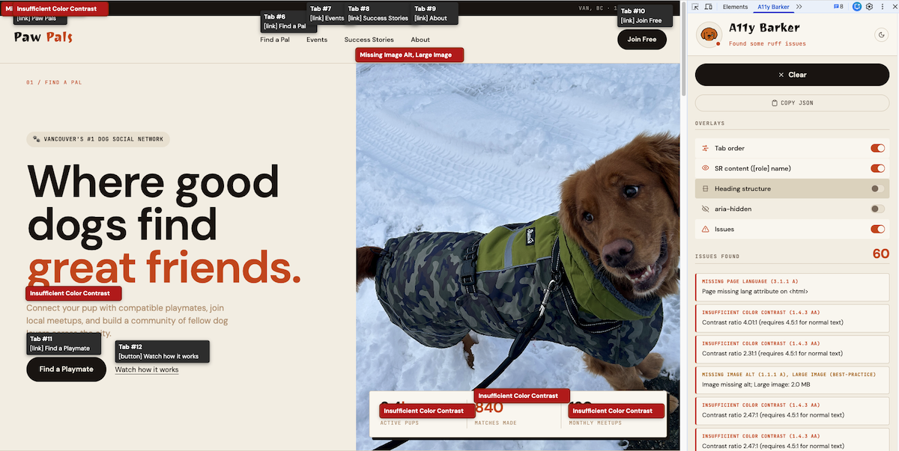

# A11y Barker 🐶

A Chrome DevTools extension for visualizing accessibility on any webpage.

🔍🐶 Barker the dog judges your markup. He's happy when your page is clean, sad when it's not, and judgemental when he's waiting.



---

## Demo

Try it on the [Paw Pals demo page](https://estherh.dev/a11y-barker/demo.html) — a intentionally inaccessible dog social network built to showcase what A11y Barker catches.

---

## Features

### Overlay Visualization

| Feature | Description |
|---|---|
| Tab order | Numbers each focusable element in keyboard navigation order |
| SR content | Displays computed accessible name and role for interactive elements |
| Heading structure | Labels every h1–h6; tree panel shows full hierarchy |
| aria-hidden | Outlines hidden elements with a dashed border |
| Issues | Highlights elements with accessibility violations directly on the page |

### Static Rule Checks

| Rule | WCAG | Level |
|---|---|---|
| Missing image alt | 1.1.1 | A |
| Empty button or link | 4.1.2 | A |
| Missing input label | 1.3.1 / 4.1.2 | A |
| Positive tabindex | 2.4.3 | A |
| Duplicate landmark (unlabeled) | 1.3.1 | A |
| Heading hierarchy skip | 1.3.1 | A |
| Ambiguous link text | 2.4.4 | A |
| Missing page language | 3.1.1 | A |
| Focus outline removed | 2.4.7 | AA |
| Color contrast insufficient | 1.4.3 | AA |
| Label in name | 2.5.3 | AA |
| Large image (>1 MB) | — | Best practice |

### SPA Support

MutationObserver watches for DOM and attribute changes (`hidden`, `aria-hidden`, `style`, `class`) and re-runs analysis automatically. Overlays stay accurate after dropdowns open, modals appear, or route changes occur.

### AI Checks (Anthropic)

With a valid API key, the panel shows **AI Check** (below **Overlays**) with two opt-in toggles (both off by default) and a **Claude model** selector:

| Toggle | What it does |
|---|---|
| Heading structure | After **Sniff page**, sends the page's visible heading list to Claude (JSON in / HTML out). Click an issue row to scroll to that heading. |
| Images alt | After **Sniff page**, reviews each non–data-URL image's `alt` in context (JSON in / HTML out). Click a row to highlight that image on the page. |

**Model:** **Haiku** is the default (faster, lower cost). Choose **Sonnet** in the panel for higher-quality analysis. Your choice is stored in extension storage and overrides the default in `config.js` once set.

Only toggles that are on when the sniff finishes trigger an API call. Turning a toggle off then on again reuses the cached result for that sniff until you Sniff again, Clear, or navigate — no duplicate requests. Changing the model clears the cache and re-runs visible AI sections when applicable.

---

## Using AI

1. Copy `config.js.sample` to `config.js` in the extension root (same folder as `manifest.json`). The real `config.js` is gitignored; the sample is safe to commit.
2. Set your Anthropic API key in `globalThis.A11Y_BARKER_CONFIG.apiKey`.
3. Optionally adjust **`model`** (default Claude Haiku) and **`maxTokens`** (default `1024`) — see below.
4. Reload the extension in `chrome://extensions` so the service worker picks up `config.js`.
5. Open DevTools, enable **Heading structure** and/or **Images alt** under **AI Check**, and pick **Haiku** or **Sonnet** if you like.
6. Run **Sniff page**.

```js
// config.js (copy from config.js.sample)
globalThis.A11Y_BARKER_CONFIG = {
  apiKey: 'your-anthropic-api-key',
  // Used when the panel has not chosen a model yet (panel selection overrides via storage).
  model: 'claude-haiku-4-5-20251001', // or 'claude-sonnet-4-5-20251022'
  // Max output tokens per request; increase if AI reviews are truncated.
  maxTokens: 1024,
};
```

Requests go from the background service worker directly to Anthropic. The inspected page never sees your key.

---

## Installation

A11y Barker is not on the Chrome Web Store. To install:

1. Clone or download this repo
2. Go to `chrome://extensions`
3. Enable **Developer mode** (top right)
4. Click **Load unpacked** and select the repo folder
5. Open DevTools on any page — find the **A11y Barker** tab

---

## Architecture

```
a11y-barker/
├── manifest.json               # Manifest V3
├── config.js.sample            # Template for config.js (commit this)
├── config.js                   # Anthropic API key — gitignored
├── background.js               # Service worker — routes messages; Anthropic fetch for AI checks
├── content.js                  # Main logic: DOM analysis + overlay orchestration
├── rules-registry.js           # WCAG metadata for all rules
├── panel.html / panel.js       # DevTools panel UI (light/dark theme, Lucide icons)
├── devtools.html / devtools.js # DevTools panel registration
├── utils/
│   └── dom.js                  # Shared DOM utilities (grouping, sorting)
├── overlay/
│   ├── index.js                # Shadow DOM host + shared helpers
│   ├── coordinator.js          # Centralizes badge positioning, prevents overlap
│   ├── TabOverlay.js           # Tab order + SR content badge data
│   ├── HeadingOverlay.js       # Heading badge data
│   ├── AriaHiddenOverlay.js    # aria-hidden badge data + outline style
│   └── HeadingTreePanel.js     # Fixed heading tree panel (bottom-right)
├── analyzer/
│   ├── tabOrder.js             # Focusable element ordering
│   ├── srContent.js            # Accessible name computation (simplified accname)
│   ├── staticRules.js          # All static rule checks
│   ├── colorContrast.js        # WCAG 1.4.3 contrast ratio checker
│   └── imageHealth.js          # Image file size check via Performance API
├── ai/
│   ├── altChecker.js           # Images + JSON prompt for alt-text review
│   └── headingChecker.js       # Headings + JSON prompt for structure review
├── docs/
│   ├── index.html              # Project landing page (SEO)
│   ├── demo.html               # Paw Pals intentionally broken demo
│   ├── og.png                  # Open Graph / social preview image
│   └── screenshot.png          # Panel screenshot
└── assets/
    └── dog/                    # Barker icon assets
```

---

## Key Design Decisions

**Shadow DOM isolation**
All overlay badges live inside a Shadow DOM host. Page styles cannot bleed in, and overlay styles cannot affect the inspected page.

**Badge coordinator**
A single coordinator collects badge data from all overlay types, groups by element, and stacks badges vertically to prevent overlap. Actual badge height is measured after DOM insertion so stacking is pixel-accurate.

**Issues as coloring, with fallback**
When an element has an issue, its existing badge (tab, heading, aria-hidden) turns red. If no other overlay is active for that element, a standalone red issue badge is rendered instead. The Issues toggle works independently of other overlays.

**AI calls via background.js**
Routing AI requests through the service worker avoids CORS. The API key, default model, and `maxTokens` are read from local `config.js` (not in the repo). The panel can override the model per install via `chrome.storage.local`; until then, `config.js` `model` applies.

**Performance API for image size**
Image file sizes are read from `performance.getEntriesByType('resource')` — no extra network request needed.

**AI checks are toggle-gated and cached**
Heading and img-alt checks only run after Sniff page when each AI Check toggle is on (defaults off). Successful responses are cached for that sniff so toggling off/on does not call the API again until a new sniff, Clear, or navigation.